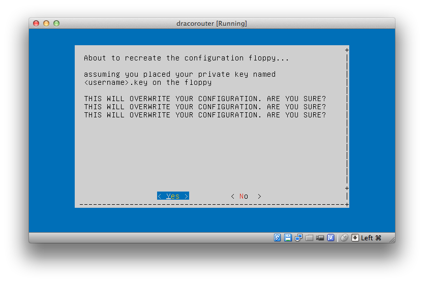

Draco Tools
===========

This repository hosts end-user tools to connect to the OverTheWire warzone.
More information about this warzone can be found on [https://draco.overthewire.org](https://draco.overthewire.org).


Connecting vulnerable machines to the warzone with a "router" account is not
trivial. To get started easily, this repository contains tools to build a virtual
virtual VPN router image that can be used to easily connect vulnerable hosts to
the warzone.

The router offers:
- separation of the VPN credentials away from any hosted vulnerable images.
- abstraction away from the VPN network setup: vulnerable hosts need not be aware that they are on a VPN network.

Building instructions
---------------------

To build a VM image, create a configfile in config/ and run "sudo ./build-vm.sh config/myconfig.ini".
There is support to build router images and vulnerable hosts in both OVA and libvirt format.

Download an OVA version of the router image here: [http://images.overthewire.org/dracorouter.ova](http://images.overthewire.org/dracorouter.ova)
This image was built using ```sudo ./build-vm.sh config/dracorouter-ova.ini```

Using the image
---------------

The router image is built in such a way that it can be distributed as-is.
User-specific configuration is applied from a virtual floppy-disk image, containing
the VPN credentials and (sub)network configuration.

To ease configuration, the VM image has builtin functionality to create this 
configuration floppy-disk for you.
Once your have created or downloaded the VM, create a blank floppy disk image
and copy your private key into the root of its filesystem. Name the private key
after your username. For instance, for user ```johndoe```, the file should be named ```johndoe.key```.
Insert this floppy disk into the virtual diskdrive and then boot the VM.

During first boot, some error messages will be shown because the floppy disk does not
contain a valid configuration yet.
Once booted, a menu will be displayed as in this screenshot:


Select the option ```(Re)create floppy``` to complete the configuration of your VM.
A warning will be shown because this process will overwrite your floppy disk image with a new one:



To complete the configuration, you must reboot the VM. Although it is possible to
complete the process without rebooting, it is far easier to just reboot at this point.


After the reboot, the VM will automatically connect the the warzone and forward traffic to
your vulnerable hosts on its private network.

